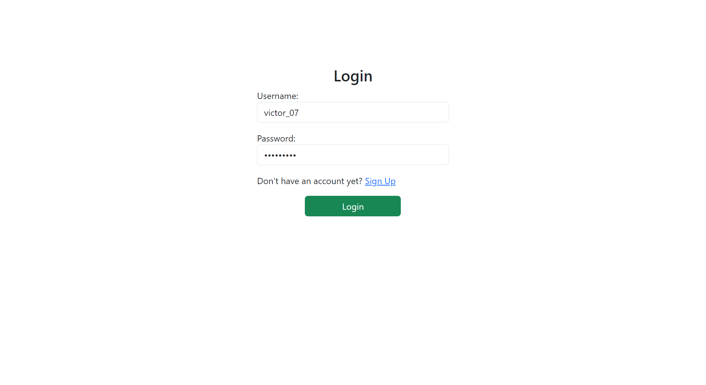
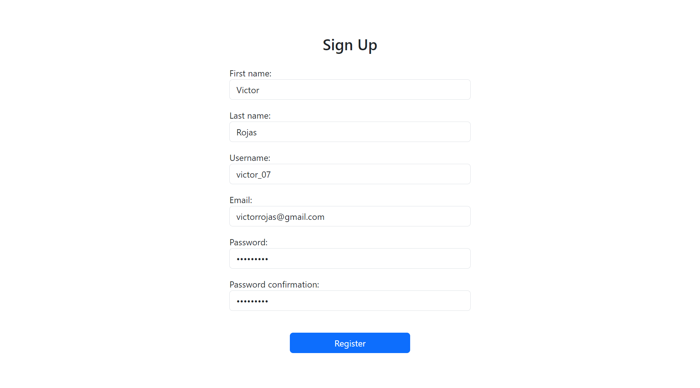
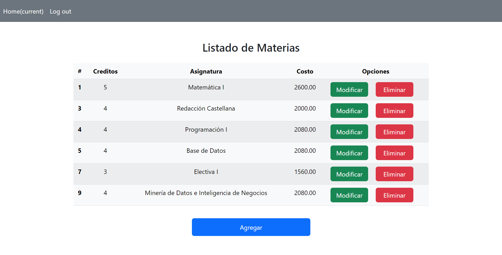
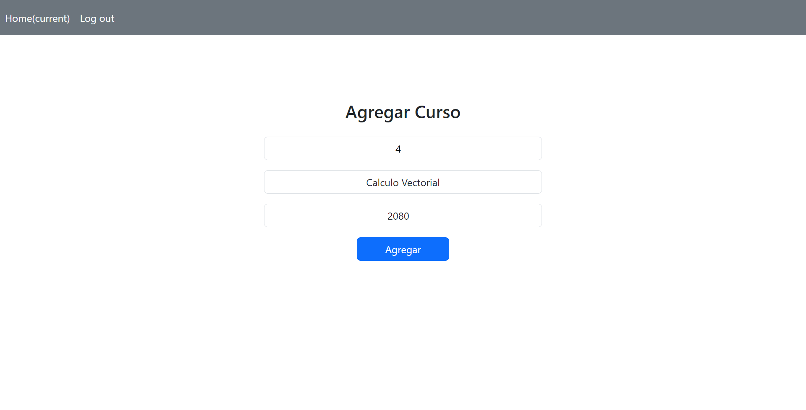
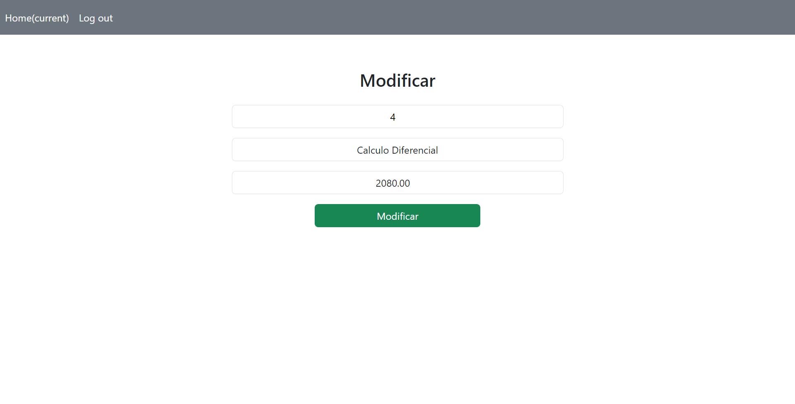
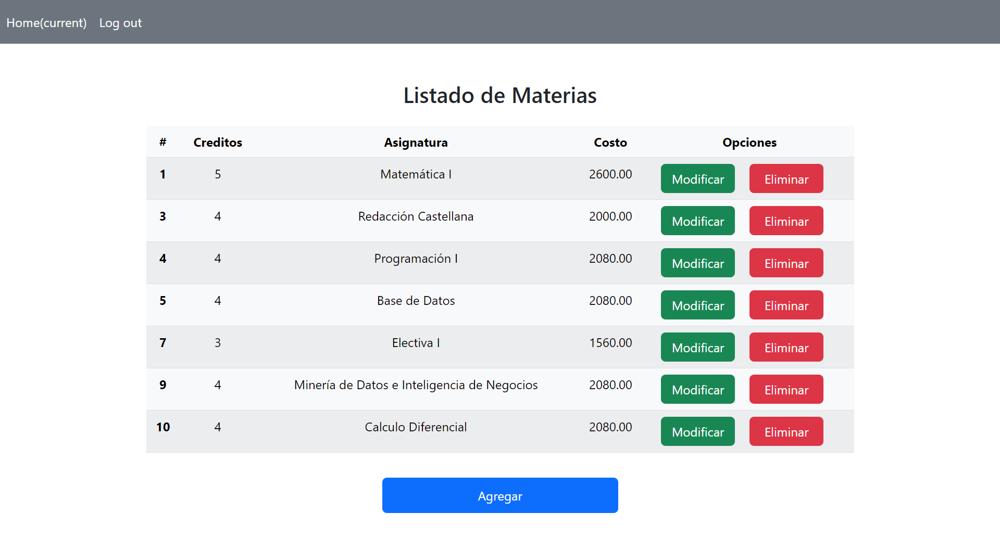

# Courses manager application

This is a course manager where users can create, edit and delete courses.

### 1. Login

In the login page the users can access to the website using the previously created account.

### 2. Sign up

Here users can do the process of creating a new account for the website.

### 3. Home

This is the home page where users can see the list of courses. The course name, price and credits is displayed.

### 4. Add course

Here is where a user can create and publish a new course. Once the course has been detailed, it can be added to the course list on the platform.

### 6. Edit course

When a user press the edit button the course is displayed in another page and every information can be modified.

### 7. Delete course

If a user presses the Delete button, the course is removed from the database and is no longer displayed in the course list.

